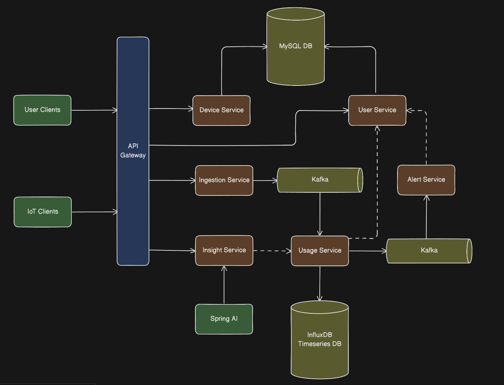

# Home Energy Tracking Microservices

> **Status: On Development**

Real-time home energy monitoring and analytics system built with Spring Boot microservices architecture, featuring event-driven communication via Kafka, time-series data storage with InfluxDB, and AI-powered insights using Spring AI.

## Architecture

```
┌──────────────┐
│ User Clients │ ─┐
└──────────────┘  │
                  ├──► API Gateway :8090 - Entry point with OAuth2 + Circuit Breaker
┌──────────────┐  │
│ IoT Clients  │ ─┘
└──────────────┘
       │
       ├──────► Device Service  :8080 - IoT device management (MySQL)
       │
       ├──────► User Service    :8081 - User & authentication management (MySQL)
       │
       ├──────► Ingestion Service :8082 - Energy data ingestion → Kafka producer
       │              │
       │              │ Kafka (ENERGY_DATA_TOPIC)
       │              ├──────────────────────────────┐
       │              ▼                              ▼
       │        Usage Service :8083            Alert Service :8085
       │        (InfluxDB consumer)            (Kafka consumer)
       │              │                              │
       │              │                              │
       │              ▼                              │
       │        InfluxDB Timeseries DB              │
       │              │                              │
       │              └──────────────────────────────┘
       │                                             │
       └──────► Insight Service :8084 ◄─────────────┘
                (Spring AI + InfluxDB analytics)
```



## Tech Stack

- **Backend**: Java 21, Spring Boot 3.5.7
- **Databases**: 
  - MySQL 8.0 (User & Device data)
  - InfluxDB 2.x (Time-series energy data)
- **Message Broker**: Apache Kafka 3.0+
- **AI/ML**: Spring AI
- **Security**: OAuth2 (Keycloak)
- **Resilience**: Resilience4j (Circuit Breaker)
- **Migration**: Flyway (SQL migrations)